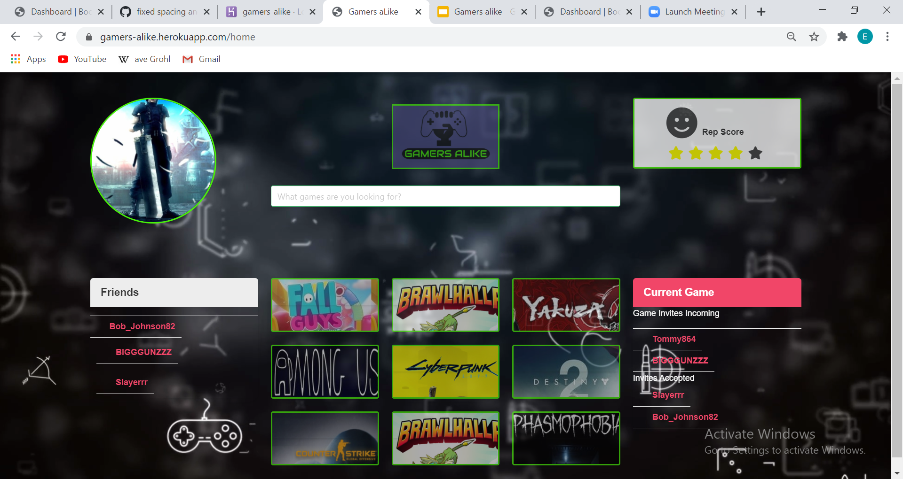

# Gamers aLike

## Description

Gamers aLike is a culmination of the skills we have leanred in the last few weeks, which include MySQL, Express and Handlebars. While simple in it's design, this applications requires highly-detailed code, across several file types, while also making a Steam api call, which we soon discovered, was not programmer friendly. Gamers aLike works the same way as a buddy finder. Through our app, the user will able to sign in to their Steam account, and then redirected back to our page. From there, the app will make an api call to Steam, which will populate the user's data, which include their friends and games list. The user will then be able to compare the similar games they own with their friends, and invite them to play when they see them online. If they's like to play with new gamers, our application also will generate cards with a few of the most popular games on Steam. The user will be able to add them by their username and send them an invite. Once the play session is over, the user will have acces to their profile and give them a rating, based on the experience, with a star rating from 1-5. A nice perk that we also provide is we allow the user to be a bit more specific in describing the gamer they just played with. Also on the gamer's profile, we have amassed character attributes, that the user can click on, and the counter will go up by one. The user will be able to see how many times that gamer has been given that attribute. It's a way to encourage gamers to be on their best behavior and make it fun to play with strangers and make future gaming friends.

 ## Installation

Gamers aLike is deployed on [Heroku](https://eat-da-burger-ep.herokuapp.com/).
  
The image below shows the startup of the app.
  

   
This shot shows the user that they will be redirected to login with their Steam credentials
  

   
Here we see how that when the user logins, they are redirected to the home page, which will generate a their a list with with their friends and game, pulled from Steam.
  

   
We see when the user selects one of their friends, is then redirected to their profile, which they will be able to rate and give a gamer attribute. 
  

  

## Questions

For any questions, contact us on any of the following links:

Email: 
* Jason Ozulumba cjozulumba@gmail.com, 
* Jonathan Peach jonmakesitbetter@gmail.com 
* Brandon Walker brandon.walker2008@gmail.com,
* Eduardo Pineda edibozu@gmail.com

Heroku: https://gamers-alike.herokuapp.com/

GitHub Repo: https://github.com/Edibozu/gamers_alike

## Contributions

This application was created by Jason Ozulumba, Jonathan Peach, Brandon Walker, and Eduardo Pineda. With contributions by our TA's, tutors, and BCS assistants. 

## License

MIT License

Copyright (c) [2020] [Jason Ozulumba, Jonathan Peach, Brandon Walker, & Eduardo Pineda]

Permission is hereby granted, free of charge, to any person obtaining a copy
of this software and associated documentation files (the "Software"), to deal
in the Software without restriction, including without limitation the rights
to use, copy, modify, merge, publish, distribute, sublicense, and/or sell
copies of the Software, and to permit persons to whom the Software is
furnished to do so, subject to the following conditions:

The above copyright notice and this permission notice shall be included in all
copies or substantial portions of the Software.

THE SOFTWARE IS PROVIDED "AS IS", WITHOUT WARRANTY OF ANY KIND, EXPRESS OR
IMPLIED, INCLUDING BUT NOT LIMITED TO THE WARRANTIES OF MERCHANTABILITY,
FITNESS FOR A PARTICULAR PURPOSE AND NONINFRINGEMENT. IN NO EVENT SHALL THE
AUTHORS OR COPYRIGHT HOLDERS BE LIABLE FOR ANY CLAIM, DAMAGES OR OTHER
LIABILITY, WHETHER IN AN ACTION OF CONTRACT, TORT OR OTHERWISE, ARISING FROM,
OUT OF OR IN CONNECTION WITH THE SOFTWARE OR THE USE OR OTHER DEALINGS IN THE
SOFTWARE.
